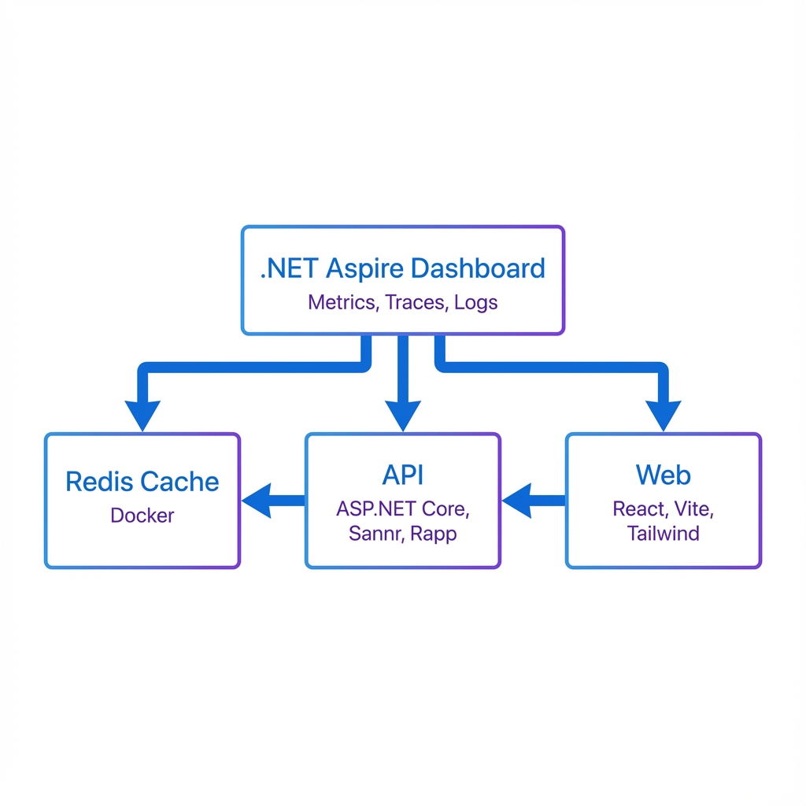

# Viking Air

A reference demonstration of AutoMappic, Sannr, Rapp, and Skugga working together in a
cloud-native .NET 10 application that publishes with Native AOT.

This is a demonstration, not a production system. It exists to prove the four libraries compose
in a realistic application, and to surface the places where they do not yet compose cleanly.
Those are recorded in [docs/known-issues.md](docs/known-issues.md).

[](https://dotnet.microsoft.com/)
[](https://learn.microsoft.com/en-us/dotnet/aspire/)
[](https://learn.microsoft.com/en-us/dotnet/core/deploying/native-aot/)

## Overview

Viking Air is a flight booking demonstration that showcases four .NET libraries built on
compile-time source generation rather than runtime reflection:

- **AutoMappic**: Object mapping via source generation.
- **Sannr**: Validation via source generation.
- **Rapp**: Schema-safe binary caching with MemoryPack.
- **Skugga**: Native AOT-compatible test doubles.

The shared premise is that removing runtime reflection makes an application publishable with
Native AOT, which lowers startup time and working set, which in turn allows more workloads to be
packed onto the same infrastructure.

The application is orchestrated by **.NET Aspire** and features a React/Tailwind frontend.

`VikingAir.Api` has been verified to publish and run as a Native AOT binary, with validation,
caching, and mapping all working in the published binary. See
[docs/benchmarks.md](docs/benchmarks.md) for the measurements and the hardware they were taken on.


## Architecture



### Components

| Component | Technology | Purpose |
|-----------|-----------|---------|
| **VikingAir.Api** | ASP.NET Core Minimal API | Backend: Sannr validation, Rapp caching, AutoMappic mapping |
| **VikingAir.Web** | React + Vite + Tailwind | Frontend user interface |
| **VikingAir.Core** | .NET Class Library | Shared models and the AutoMappic mapping profile |
| **VikingAir.AppHost** | .NET Aspire | Orchestrates all services + Redis |
| **VikingAir.EvolutionDemo** | Console App | Demonstrates Rapp's schema safety |
| **VikingAir.Tests** | xUnit + Skugga | Validation, mapping, cache and payment-gateway tests |
| **VikingAir.Benchmarks** | BenchmarkDotNet | Performance comparisons |

## Quick Start

### Prerequisites

- [.NET 10 SDK](https://dotnet.microsoft.com/download/dotnet/10.0)
- [Docker Desktop](https://www.docker.com/products/docker-desktop) (for Redis)
- [Node.js 18+](https://nodejs.org/) (for the Web frontend)

### Run the Demo

```bash
cd viking-air
dotnet run --project VikingAir.AppHost
```

This command starts:
- Redis container
- VikingAir.Api (.NET 10 backend)
- VikingAir.Web (React frontend)
- Aspire Dashboard

### Access the Application

1. **Aspire Dashboard**: The console will show the URL (usually `https://localhost:17299`)
2. **Web App**: Select the `web` resource in the Aspire Dashboard
3. **API**: Select the `api` resource in the Aspire Dashboard

## Features

### Sannr Validation

Sannr generates a validator for the model at compile time.

```csharp
[Required(ErrorMessage = "Flight code is required")]
[StringLength(10, MinimumLength = 3)]
[Sanitize(Trim = true, ToUpper = true)]
public string FlightCode { get; set; } = "";
```

- Faster and lower-allocation than DataAnnotations and FluentValidation on this model
- `[Sanitize]` normalises values in place before the rules run
- Compile-time code generation, no reflection

Note: this API validates **explicitly in the handler** rather than using Sannr's
`WithSannrValidation` endpoint filter. The filter did not reject invalid payloads in testing, and
Sannr treats an unregistered type as valid, so the filter would have produced an API with no
input validation and no error. See [docs/known-issues.md](docs/known-issues.md#1-sannr-aspnet-core-integration-does-not-enforce-validation).

### AutoMappic Mapping

AutoMappic generates the mapping between the wire, persistence, and response shapes at compile
time. All mapping lives in `VikingAir.Core` behind the `BookingMapping` facade.

```csharp
var entity       = BookingMapping.ToEntity(request);       // wire -> persistence
var confirmation = BookingMapping.ToConfirmation(entity);  // persistence -> response
```

The response shape deliberately carries only a three-character passport suffix, never the full
passport number. `VikingAir.Tests/MappingTests.cs` asserts that, including a check over the
serialised response so a future added member cannot silently re-expose it.

### Rapp Caching

Rapp enables schema-safe binary caching.

```csharp
[RappCache]
[MemoryPackable]
public partial class BookingRequest
{
    // Properties...
}
```

- Schema hash prevents deserialization of incompatible data
- Binary serialization using MemoryPack
- Native AOT compatible

### Skugga Test Doubles

Skugga generates test doubles at compile time, so the test suite runs under Native AOT without
runtime proxy generation. See `VikingAir.Tests/BookingTests.cs`.

### Observability

Integration with .NET Aspire provides:
- Metrics
- Distributed tracing
- Structured logs
- Health checks

## Testing the Demo

### Valid Booking Request

```json
{
  "flightCode": "VA123",
  "passportNumber": "ABC123DEF",
  "seatPreference": "Window"
}
```

### Invalid Booking Request

```json
{
  "flightCode": "INVALID",
  "passportNumber": "X",
  "seatPreference": "BadSeat"
}
```

## Performance

The numbers below were produced by this repository's benchmark project. The full tables, the
hardware they were taken on, and the caveats are in [docs/benchmarks.md](docs/benchmarks.md).
Nothing here should be quoted without that context.

### Validation

| Method | Mean | Allocated |
|---|---:|---:|
| FluentValidation (baseline) | 164.51 ns | 696 B |
| DataAnnotations | 366.83 ns | 1224 B |
| **Sannr** | **56.59 ns** | **256 B** |

Sannr is about 2.9x faster than FluentValidation and 6.5x faster than DataAnnotations on this
model, and allocates 63% less than FluentValidation.

### Mapping

| Method | Mean | Allocated |
|---|---:|---:|
| Hand-written (baseline) | 56.21 ns | 136 B |
| **AutoMappic** | **68.64 ns** | **208 B** |
| AutoMapper | 152.81 ns | 136 B |

AutoMappic is about 2.2x faster than AutoMapper and works under Native AOT, which AutoMapper does
not. It is 22% slower than a hand-written mapper and currently allocates more than either
alternative; that allocation overhead is an open issue, not a property of the approach.

### Serialization

Binary (MemoryPack, used by Rapp) against System.Text.Json: about 2.6x faster to serialize and
4.3x faster to deserialize on this payload.

*Measured on a Snapdragon X Elite X1E80100 (ARM64), Windows 11, .NET 10.0.12, BenchmarkDotNet
0.15.8. A developer laptop, not a server.*

To run the benchmarks:

```bash
dotnet run -c Release --project VikingAir.Benchmarks -- --filter '*'
```

The benchmarks fail rather than report a number if a library under test is not actually wired up.

## Build and Deployment

### Native AOT Build

```bash
cd VikingAir.Api
dotnet publish -c Release -r linux-x64 --self-contained true /p:PublishAot=true
```

### Docker (via Aspire)

Aspire can generate Docker Compose files:

```bash
dotnet run --project VikingAir.AppHost -- --publisher manifest
```

## Project Structure

```
viking-air/
├── VikingAir.Api/              # ASP.NET Core Minimal API
│   └── Program.cs              # Sannr + Rapp integration
├── VikingAir.Core/             # Shared models
│   └── BookingRequest.cs       # [RappCache] + [MemoryPackable]
├── VikingAir.Web/              # React + Vite + Tailwind
│   ├── src/
│   │   ├── App.tsx             # Main UI component
│   │   └── index.css           # Tailwind styles
│   └── package.json
├── VikingAir.AppHost/          # Aspire orchestration
│   └── Program.cs              # Service configuration
├── VikingAir.EvolutionDemo/    # Rapp schema safety demo
├── VikingAir.Benchmarks/       # Performance comparisons
└── README.md                   # This file
```

## Contributing

This is a demonstration project showcasing the Viking AOT Suite. For issues or contributions to the individual libraries, please visit their respective repositories:

- **Sannr**: [https://github.com/Digvijay/Sannr](https://github.com/Digvijay/Sannr)
- **Rapp**: [https://github.com/Digvijay/Rapp](https://github.com/Digvijay/Rapp)
- **Skugga**: [https://github.com/Digvijay/Skugga](https://github.com/Digvijay/Skugga)

## License

This project is licensed under the MIT License - see the [LICENSE](LICENSE) file for details.

